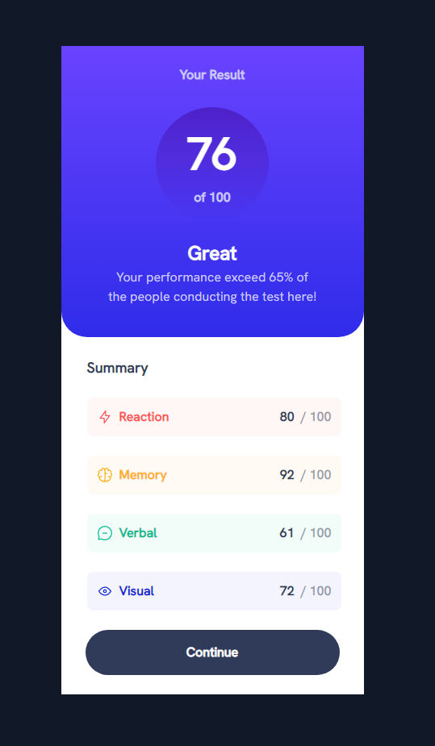
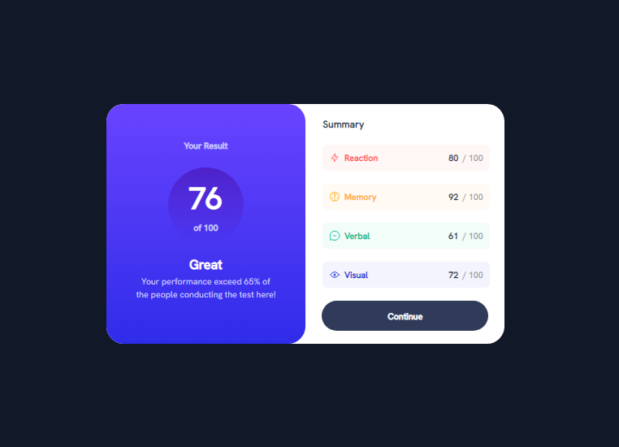
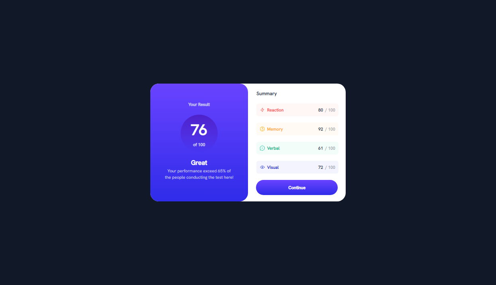

# Frontend Mentor - Results summary component solution

This is a solution to the [Results summary component challenge on Frontend Mentor](https://www.frontendmentor.io/challenges/results-summary-component-CE_K6s0maV). Frontend Mentor challenges help you improve your coding skills by building realistic projects.

## Table of contents

- [Overview](#overview)
  - [The challenge](#the-challenge)
  - [Screenshot](#screenshot)
  - [Links](#links)
- [My process](#my-process)
  - [Built with](#built-with)
  - [What I learned](#what-i-learned)
  - [Continued development](#continued-development)
  - [Useful resources](#useful-resources)
- [Author](#author)

## Overview

### The challenge

Users should be able to:

- View the optimal layout for the interface depending on their device's screen size
- See hover and focus states for all interactive elements on the page

### Screenshot





### Links

- Solution URL: [GitHub Solution](https://github.com/dawkey95/Results-Summary-Challenge)
- Live Site URL: [Live Challenge](https://dakey-results-summary-challenge.netlify.app/)

## My process

### Built with

- [Astro](https://astro.build/) - React framework
- [React](https://reactjs.org/) - JS library
- [Tailwind](https://tailwindcss.com/) - For styles

### What I learned

In this project I decided to move away from Material-UI and CRA for my projects. I instead decided to try using tailwind.css for my styling as suggested by a friend of mine. I also decided to move to using Astro for my framework and found that I really enjoyed the ease-of-use and overall feel and speed when creating apps. One thing I wanted to do from outset of learning tailwind and astro was to keep my code as clean as possible and I did this by using an external css file rather than inline styling my tailwind css.

One thing I tried was instead of creating a seperate card for each category, which would result in a lot of duplicate code I decided to use `map()` in order to create my categories and dynimcally fill them.

```js
items.map((item) => {
	return (
		<div class={`category ${item.category}`} key={item.id}>
			<div class="category-name">
				
				<p class="category-title">{item.category}</p>
			</div>
			<div class="category-score">
				<p class="your-category-score">{item.score}</p>
				<p class="category-out-100">/ 100</p>
			</div>
		</div>
	);
});
```

I also used the `tailwind.config.js` file where I needed custom styles to be used in my code. One place I used this was to create the gradient colors.

```js
gradientColorStops: {
	gradient1: ['#7755FF 0%', '#6943FF 0.01%', '#2F2CE9 100%'],
	gradient2: [
		'#4D21C9 0%',
		'rgba(37, 33, 201, 0) 100%',
		'rgba(37, 33, 201, 0) 100%',
	],
},
```

```css
.card-header {
	@apply flex flex-col justify-center items-center bg-gradient-to-b from-gradient1-0 via-gradient1-1 to-gradient1-2 rounded-cardHeader desktop:w-1/2 desktop:rounded-desktop-cardHeader;
}
```

### Continued development

I hope to continue developing my skills around using tailwind.css and astro as my framework for building react/tailwind projects.

### Useful resources

- [ChatGPT](https://openai.com/blog/chatgpt) - With the world moving towards AI, I decided to utilise chatGPT in order to ask questions when I got stuck and then tried to implement the suggestions into my own coding.

## Author

- Website - [Dawid Keyser](https://dawid-keyser-personal.netlify.app/)
- Frontend Mentor - [@dawkey95](https://www.frontendmentor.io/profile/yourusername)
